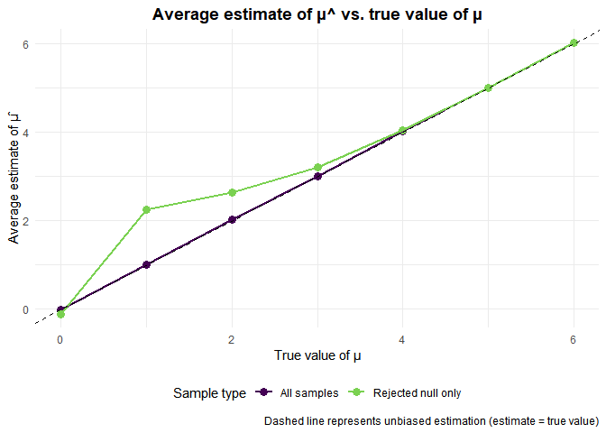
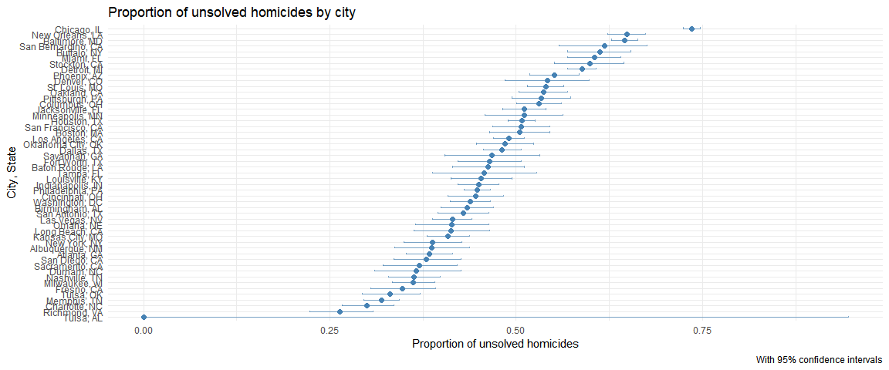

P8105 HOMEWORK 5
================
Anu Singh
2025-11-14

Global settings for assignment:

``` r
knitr::opts_chunk$set(echo = TRUE, message = FALSE, warning = FALSE)

library(tidyverse)
```

    ## ── Attaching core tidyverse packages ──────────────────────── tidyverse 2.0.0 ──
    ## ✔ dplyr     1.1.4     ✔ readr     2.1.5
    ## ✔ forcats   1.0.0     ✔ stringr   1.5.2
    ## ✔ ggplot2   3.5.2     ✔ tibble    3.3.0
    ## ✔ lubridate 1.9.4     ✔ tidyr     1.3.1
    ## ✔ purrr     1.1.0     
    ## ── Conflicts ────────────────────────────────────────── tidyverse_conflicts() ──
    ## ✖ dplyr::filter() masks stats::filter()
    ## ✖ dplyr::lag()    masks stats::lag()
    ## ℹ Use the conflicted package (<http://conflicted.r-lib.org/>) to force all conflicts to become errors

``` r
theme_set(theme_minimal() + theme(legend.position = "bottom"))

# Setting UNI as seed
set.seed(7923)
```

## PROBLEM 1

### Function to simulate birthdays and checking for duplicates

``` r
bday_sim = function(n_room) {
  birthdays = sample(1:365, n_room, replace = TRUE)
  
  # Checking if there are duplicate birthdays
  # If length of unique birthdays < total people, then there is a duplicate
  repeated_birthday = length(unique(birthdays)) < n_room
  
  return(repeated_birthday)
}
```

### Running simulations for multiple group sizes

``` r
# Creating a dataframe with all combinations of group sizes and iterations
bday_sim_results = 
  expand_grid(
    bdays = 2:50,           
    iter = 1:10000          
  ) %>% 
  mutate(
    result = map_lgl(bdays, bday_sim)  # running simulation for each row
  ) %>% 
  group_by(bdays) %>% 
  summarize(
    prob_repeat = mean(result)  # calculating probability for each group size
  )

# Viewing the results
head(bday_sim_results, 10)
```

    ## # A tibble: 10 × 2
    ##    bdays prob_repeat
    ##    <int>       <dbl>
    ##  1     2      0.0032
    ##  2     3      0.0082
    ##  3     4      0.0158
    ##  4     5      0.0276
    ##  5     6      0.041 
    ##  6     7      0.0569
    ##  7     8      0.0737
    ##  8     9      0.101 
    ##  9    10      0.117 
    ## 10    11      0.146

### Creating a plot

``` r
bday_sim_results %>% 
  ggplot(aes(x = bdays, y = prob_repeat)) +
  geom_point(alpha = 0.6, color = "steelblue", size = 2) +
  geom_line(color = "steelblue") +
  labs(
    title = "Birthday problem: probability of shared birthdays",
    subtitle = "Based on 10,000 simulations per group size",
    x = "Number of people in room",
    y = "Probability of at least one shared birthday"
  ) +
  scale_y_continuous(labels = scales::percent_format()) +
  geom_hline(yintercept = 0.5, linetype = "dashed", color = "red", alpha = 0.5) +
  annotate("text", x = 10, y = 0.52, label = "50% probability", 
           color = "red", size = 3)
```

<!-- -->

**Comment on results:**

- The probability of at least two people sharing a birthday increases
  rapidly as the group size grows.

- With approximately 23 people in a room, there is already about a 50%
  chance that two people share a birthday.

- By the time we have 50 people in a room, the probability of at least
  one shared birthday is approximately 97%, approaching near certainty.

## PROBLEM 2

### Simulation function

First, I will create a function to simulate data from a normal
distribution and perform a one-sample t-test:

``` r
sim_t_test = function(n = 30, mu = 0, sigma = 5) {
  # Generating data from Normal(mu, sigma)
  sim_data = tibble(
    x = rnorm(n = n, mean = mu, sd = sigma)
  )
  
  # Performing one-sample t-test testing H: μ = 0
  test_result = t.test(sim_data$x, mu = 0) %>% 
    broom::tidy() %>% 
    select(estimate, p.value)
  
  return(test_result)
}
```

### Simulation for μ = 0

Generating 5000 datasets with μ = 0:

``` r
sim_results_mu0 = 
  # Creating tibble with 5000 rows
  tibble(iter = 1:5000) %>% 
  mutate(
    # Running simulation function 5000 times
    test_results = map(iter, ~sim_t_test(mu = 0)) 
  ) %>% 
  unnest(test_results)

# Preview of results
head(sim_results_mu0)
```

    ## # A tibble: 6 × 3
    ##    iter estimate p.value
    ##   <int>    <dbl>   <dbl>
    ## 1     1   0.202  0.842  
    ## 2     2   0.0674 0.933  
    ## 3     3   0.561  0.464  
    ## 4     4  -1.51   0.0945 
    ## 5     5  -2.39   0.00967
    ## 6     6  -0.333  0.629

### Simulation for μ = {1, 2, 3, 4, 5, 6}

Now I will repeat the same simulation process, but for different values
of μ:

``` r
sim_results_all = 
  tibble(true_mu = c(0, 1, 2, 3, 4, 5, 6)) %>% 
  mutate(
    sim_data = map(true_mu, ~tibble(iter = 1:5000) %>% 
                     mutate(test_results = map(iter, function(x) sim_t_test(mu = .x))) %>% 
                     unnest(test_results))
  ) %>% 
  unnest(sim_data)

# Preview results
head(sim_results_all)
```

    ## # A tibble: 6 × 4
    ##   true_mu  iter estimate p.value
    ##     <dbl> <int>    <dbl>   <dbl>
    ## 1       0     1 -1.37      0.183
    ## 2       0     2  0.554     0.536
    ## 3       0     3 -0.949     0.351
    ## 4       0     4  0.508     0.508
    ## 5       0     5 -0.670     0.529
    ## 6       0     6  0.00137   0.999

### Power vs. effect size

I will first calculate the proportion of times the null was rejected
(power) for each true μ. Then I will generate a plot of power vs. true
value of μ:

``` r
power_results = sim_results_all %>% 
  group_by(true_mu) %>% 
  summarize(
    power = mean(p.value < 0.05),
    n_tests = n()
  )

power_results
```

    ## # A tibble: 7 × 3
    ##   true_mu  power n_tests
    ##     <dbl>  <dbl>   <int>
    ## 1       0 0.0466    5000
    ## 2       1 0.180     5000
    ## 3       2 0.567     5000
    ## 4       3 0.888     5000
    ## 5       4 0.989     5000
    ## 6       5 1.000     5000
    ## 7       6 1         5000

``` r
# Plot of power vs. true value of μ
power_results %>% 
  ggplot(aes(x = true_mu, y = power)) +
  geom_point(size = 3, color = "steelblue") +
  geom_line(linewidth = 1, color = "steelblue") +
  scale_y_continuous(limits = c(0, 1), breaks = seq(0, 1, 0.1)) +
  labs(
    title = "Power vs. effect size in one-sample t-test",
    x = "True value of μ",
    y = "Power (proportion of times null rejected)",
    caption = "n = 30, σ = 5, α = 0.05, 5000 simulations per μ value"
  )
```

<!-- -->

**Association between effect size and power:** as the true effect size
(μ) increases from 0 to 6, the power of the test increases
significantly. The relationship is non-linear, with power rising steeply
between μ = 1 and μ = 3, then plateauing near 1.0 for larger effect
sizes. This shows that larger effect sizes are easier to detect, thereby
resulting in higher power.

### Average estimate of μ̂

Next, I will calculate average estimates across all tests and for tests
where null was rejected. I will then transpose the data frame for
analysis, and create the plot:

``` r
# Calculating summary statistics, 
estimate_results = sim_results_all %>% 
  group_by(true_mu) %>% 
  summarize(
    avg_estimate_all = mean(estimate),
    avg_estimate_rejected = mean(estimate[p.value < 0.05]),
    n_all = n(),
    n_rejected = sum(p.value < 0.05)
  )

estimate_results
```

    ## # A tibble: 7 × 5
    ##   true_mu avg_estimate_all avg_estimate_rejected n_all n_rejected
    ##     <dbl>            <dbl>                 <dbl> <int>      <int>
    ## 1       0         -0.00922                -0.126  5000        233
    ## 2       1          1.00                    2.25   5000        899
    ## 3       2          2.02                    2.63   5000       2837
    ## 4       3          3.01                    3.20   5000       4441
    ## 5       4          4.01                    4.03   5000       4945
    ## 6       5          5.00                    5.00   5000       4999
    ## 7       6          6.01                    6.01   5000       5000

``` r
# Preparing data for plotting
plot_data = estimate_results %>% 
  pivot_longer(
    cols = c(avg_estimate_all, avg_estimate_rejected),
    names_to = "condition",
    values_to = "avg_estimate"
  ) %>% 
  mutate(
    condition = recode(condition,
                      "avg_estimate_all" = "All samples",
                      "avg_estimate_rejected" = "Rejected null only")
  )

# Creating the plot
ggplot(plot_data, aes(x = true_mu, y = avg_estimate, color = condition)) +
  geom_point(size = 3) +
  geom_line(linewidth = 1) +
  geom_abline(intercept = 0, slope = 1, linetype = "dashed", color = "black") +
  scale_color_viridis_d(end = 0.8) +  
  labs(
    title = "Average estimate of μ^ vs. true value of μ",
    x = "True value of μ",
    y = "Average estimate of μ̂",
    color = "Sample type",
    caption = "Dashed line represents unbiased estimation (estimate = true value)"
  ) +
  theme(plot.title = element_text(hjust = 0.5, face = "bold"))
```

<!-- -->

**Is the sample average of μ̂ across tests for which the null is rejected
approximately equal to the true value of μ? Why or why not?**

No, the sample average of μ̂ for tests where the null is rejected is not
approximately equal to the true value of μ, especially for small effect
sizes (μ = 1, 2, 3). This is because:

1.  When we only look at samples where the null was rejected, we are
    filtering based on statistical significance. This creates a
    selection bias where we are more likely to include samples with
    extreme (larger) estimates of μ̂.

2.  When the true effect size is small (e.g., μ = 1 or 2), power is low.
    This means that to achieve significance, the sample must have
    produced an unusually large estimate. These “lucky” samples
    overestimate the true effect.

3.  As the true μ increases (4, 5, 6), power approaches 1.0, thus nearly
    all samples reject the null. When almost all samples are included,
    there is less selection bias, and the average estimate among
    rejected samples converges to the true value.

4.  The average estimate across all samples (green line) closely follows
    the true value of μ (the dashed line), thus showing that μ̂ is an
    unbiased estimator when we do not filter based on significance.

Therefore, if we only pay attention to statistically significant
findings, we are likely to overestimate effect sizes, especially in
cases/studies with low power. This is why the “rejected null only” line
sits above the dashed line (thereby overestimating) for small μ values.

## PROBLEM 3

### Description of raw data

``` r
# Reading the homicide data
homicide_data = read_csv("./data/homicide-data.csv")

# Displaying structure of the data
str(homicide_data)
```

    ## spc_tbl_ [52,179 × 12] (S3: spec_tbl_df/tbl_df/tbl/data.frame)
    ##  $ uid          : chr [1:52179] "Alb-000001" "Alb-000002" "Alb-000003" "Alb-000004" ...
    ##  $ reported_date: num [1:52179] 20100504 20100216 20100601 20100101 20100102 ...
    ##  $ victim_last  : chr [1:52179] "GARCIA" "MONTOYA" "SATTERFIELD" "MENDIOLA" ...
    ##  $ victim_first : chr [1:52179] "JUAN" "CAMERON" "VIVIANA" "CARLOS" ...
    ##  $ victim_race  : chr [1:52179] "Hispanic" "Hispanic" "White" "Hispanic" ...
    ##  $ victim_age   : chr [1:52179] "78" "17" "15" "32" ...
    ##  $ victim_sex   : chr [1:52179] "Male" "Male" "Female" "Male" ...
    ##  $ city         : chr [1:52179] "Albuquerque" "Albuquerque" "Albuquerque" "Albuquerque" ...
    ##  $ state        : chr [1:52179] "NM" "NM" "NM" "NM" ...
    ##  $ lat          : num [1:52179] 35.1 35.1 35.1 35.1 35.1 ...
    ##  $ lon          : num [1:52179] -107 -107 -107 -107 -107 ...
    ##  $ disposition  : chr [1:52179] "Closed without arrest" "Closed by arrest" "Closed without arrest" "Closed by arrest" ...
    ##  - attr(*, "spec")=
    ##   .. cols(
    ##   ..   uid = col_character(),
    ##   ..   reported_date = col_double(),
    ##   ..   victim_last = col_character(),
    ##   ..   victim_first = col_character(),
    ##   ..   victim_race = col_character(),
    ##   ..   victim_age = col_character(),
    ##   ..   victim_sex = col_character(),
    ##   ..   city = col_character(),
    ##   ..   state = col_character(),
    ##   ..   lat = col_double(),
    ##   ..   lon = col_double(),
    ##   ..   disposition = col_character()
    ##   .. )
    ##  - attr(*, "problems")=<externalptr>

``` r
# Summary of the data
summary(homicide_data)
```

    ##      uid            reported_date       victim_last        victim_first      
    ##  Length:52179       Min.   : 20070101   Length:52179       Length:52179      
    ##  Class :character   1st Qu.: 20100318   Class :character   Class :character  
    ##  Mode  :character   Median : 20121216   Mode  :character   Mode  :character  
    ##                     Mean   : 20130899                                        
    ##                     3rd Qu.: 20150911                                        
    ##                     Max.   :201511105                                        
    ##                                                                              
    ##  victim_race         victim_age         victim_sex            city          
    ##  Length:52179       Length:52179       Length:52179       Length:52179      
    ##  Class :character   Class :character   Class :character   Class :character  
    ##  Mode  :character   Mode  :character   Mode  :character   Mode  :character  
    ##                                                                             
    ##                                                                             
    ##                                                                             
    ##                                                                             
    ##     state                lat             lon          disposition       
    ##  Length:52179       Min.   :25.73   Min.   :-122.51   Length:52179      
    ##  Class :character   1st Qu.:33.77   1st Qu.: -96.00   Class :character  
    ##  Mode  :character   Median :38.52   Median : -87.71   Mode  :character  
    ##                     Mean   :37.03   Mean   : -91.47                     
    ##                     3rd Qu.:40.03   3rd Qu.: -81.76                     
    ##                     Max.   :45.05   Max.   : -71.01                     
    ##                     NA's   :60      NA's   :60

``` r
# Looking at first few rows
head(homicide_data)
```

    ## # A tibble: 6 × 12
    ##   uid   reported_date victim_last victim_first victim_race victim_age victim_sex
    ##   <chr>         <dbl> <chr>       <chr>        <chr>       <chr>      <chr>     
    ## 1 Alb-…      20100504 GARCIA      JUAN         Hispanic    78         Male      
    ## 2 Alb-…      20100216 MONTOYA     CAMERON      Hispanic    17         Male      
    ## 3 Alb-…      20100601 SATTERFIELD VIVIANA      White       15         Female    
    ## 4 Alb-…      20100101 MENDIOLA    CARLOS       Hispanic    32         Male      
    ## 5 Alb-…      20100102 MULA        VIVIAN       White       72         Female    
    ## 6 Alb-…      20100126 BOOK        GERALDINE    White       91         Female    
    ## # ℹ 5 more variables: city <chr>, state <chr>, lat <dbl>, lon <dbl>,
    ## #   disposition <chr>

``` r
# Checking unique disposition values
unique(homicide_data$disposition)
```

    ## [1] "Closed without arrest" "Closed by arrest"      "Open/No arrest"

### Description of raw data

The dataset contains 52179 homicide cases across 50 cities. It includes
the following variables:

- **uid**: unique identifier for each case
- **reported_date**: date the homicide was reported
- **victim_last, victim_first**: victim’s name
- **victim_race**: race of the victim
- **victim_age**: age of the victim
- **victim_sex**: sex of the victim
- **city**: city where homicide occurred
- **state**: state where homicide occurred
- **lat, lon**: geographic coordinates
- **disposition**: case status (closed by arrest, closed without arrest,
  or open/no arrest)

### city_state variable and creating summary of homicides by city

``` r
homicide_summary = homicide_data %>%
  # Creating city_state variable
  mutate(city_state = paste(city, state, sep = ", ")) %>%
  # Grouping by city_state
  group_by(city_state) %>%
  # Calculating total and unsolved homicides
  summarize(
    total_homicides = n(),
    unsolved_homicides = sum(disposition %in% c("Closed without arrest", "Open/No arrest")),
    .groups = "drop"
  )

# Displaying the summary
knitr::kable(
  homicide_summary,
  col.names = c("City, state", "Total homicides", "Unsolved homicides"),
  caption = "Summary of homicides by city",
)
```

| City, state        | Total homicides | Unsolved homicides |
|:-------------------|----------------:|-------------------:|
| Albuquerque, NM    |             378 |                146 |
| Atlanta, GA        |             973 |                373 |
| Baltimore, MD      |            2827 |               1825 |
| Baton Rouge, LA    |             424 |                196 |
| Birmingham, AL     |             800 |                347 |
| Boston, MA         |             614 |                310 |
| Buffalo, NY        |             521 |                319 |
| Charlotte, NC      |             687 |                206 |
| Chicago, IL        |            5535 |               4073 |
| Cincinnati, OH     |             694 |                309 |
| Columbus, OH       |            1084 |                575 |
| Dallas, TX         |            1567 |                754 |
| Denver, CO         |             312 |                169 |
| Detroit, MI        |            2519 |               1482 |
| Durham, NC         |             276 |                101 |
| Fort Worth, TX     |             549 |                255 |
| Fresno, CA         |             487 |                169 |
| Houston, TX        |            2942 |               1493 |
| Indianapolis, IN   |            1322 |                594 |
| Jacksonville, FL   |            1168 |                597 |
| Kansas City, MO    |            1190 |                486 |
| Las Vegas, NV      |            1381 |                572 |
| Long Beach, CA     |             378 |                156 |
| Los Angeles, CA    |            2257 |               1106 |
| Louisville, KY     |             576 |                261 |
| Memphis, TN        |            1514 |                483 |
| Miami, FL          |             744 |                450 |
| Milwaukee, wI      |            1115 |                403 |
| Minneapolis, MN    |             366 |                187 |
| Nashville, TN      |             767 |                278 |
| New Orleans, LA    |            1434 |                930 |
| New York, NY       |             627 |                243 |
| Oakland, CA        |             947 |                508 |
| Oklahoma City, OK  |             672 |                326 |
| Omaha, NE          |             409 |                169 |
| Philadelphia, PA   |            3037 |               1360 |
| Phoenix, AZ        |             914 |                504 |
| Pittsburgh, PA     |             631 |                337 |
| Richmond, VA       |             429 |                113 |
| Sacramento, CA     |             376 |                139 |
| San Antonio, TX    |             833 |                357 |
| San Bernardino, CA |             275 |                170 |
| San Diego, CA      |             461 |                175 |
| San Francisco, CA  |             663 |                336 |
| Savannah, GA       |             246 |                115 |
| St. Louis, MO      |            1677 |                905 |
| Stockton, CA       |             444 |                266 |
| Tampa, FL          |             208 |                 95 |
| Tulsa, AL          |               1 |                  0 |
| Tulsa, OK          |             583 |                193 |
| Washington, DC     |            1345 |                589 |

Summary of homicides by city

here are 51 unique city-state combinations in the dataset (Note: Tulsa
appears in both AL and OK, due to error in the original dataset).

### Proportion test for Baltimore, MD

``` r
# Filtering for Baltimore, MD
baltimore_data = homicide_summary %>%
  filter(city_state == "Baltimore, MD")

# Performing proportion test
baltimore_test <- prop.test(
  x = baltimore_data$unsolved_homicides,
  n = baltimore_data$total_homicides
)

# Tidying the results
baltimore_results <- baltimore_test %>%
  broom::tidy() %>%
  select(estimate, conf.low, conf.high)

# Displaying results
baltimore_results
```

    ## # A tibble: 1 × 3
    ##   estimate conf.low conf.high
    ##      <dbl>    <dbl>     <dbl>
    ## 1    0.646    0.628     0.663

For Baltimore, MD:

- **Estimated proportion of unsolved homicides**: 0.646
- **95% Confidence Interval**: (0.628, 0.663)

### Running prop.test for each city

``` r
# Creating a function to run prop.test and extracting estimates and CIs
prop_test_city = function(unsolved, total) {
  test_result = prop.test(x = unsolved, n = total)
  
  test_result %>%
    broom::tidy() %>%
    select(estimate, conf.low, conf.high)
}

# Applying prop.test to all cities using map2
all_cities_results = homicide_summary %>%
  mutate(
    test_results = map2(unsolved_homicides, total_homicides, prop_test_city)
  ) %>%
  unnest(test_results)

# Displaying results
knitr::kable(
  all_cities_results,
  col.names = c("City, state", "Total homicides", "Unsolved homicides", 
                "Proportion", "95% CI lower", "95% CI upper"),
  digits = 3,
  caption = "Proportion of unsolved homicides by city with 95% CIs"
)
```

| City, state | Total homicides | Unsolved homicides | Proportion | 95% CI lower | 95% CI upper |
|:---|---:|---:|---:|---:|---:|
| Albuquerque, NM | 378 | 146 | 0.386 | 0.337 | 0.438 |
| Atlanta, GA | 973 | 373 | 0.383 | 0.353 | 0.415 |
| Baltimore, MD | 2827 | 1825 | 0.646 | 0.628 | 0.663 |
| Baton Rouge, LA | 424 | 196 | 0.462 | 0.414 | 0.511 |
| Birmingham, AL | 800 | 347 | 0.434 | 0.399 | 0.469 |
| Boston, MA | 614 | 310 | 0.505 | 0.465 | 0.545 |
| Buffalo, NY | 521 | 319 | 0.612 | 0.569 | 0.654 |
| Charlotte, NC | 687 | 206 | 0.300 | 0.266 | 0.336 |
| Chicago, IL | 5535 | 4073 | 0.736 | 0.724 | 0.747 |
| Cincinnati, OH | 694 | 309 | 0.445 | 0.408 | 0.483 |
| Columbus, OH | 1084 | 575 | 0.530 | 0.500 | 0.560 |
| Dallas, TX | 1567 | 754 | 0.481 | 0.456 | 0.506 |
| Denver, CO | 312 | 169 | 0.542 | 0.485 | 0.598 |
| Detroit, MI | 2519 | 1482 | 0.588 | 0.569 | 0.608 |
| Durham, NC | 276 | 101 | 0.366 | 0.310 | 0.426 |
| Fort Worth, TX | 549 | 255 | 0.464 | 0.422 | 0.507 |
| Fresno, CA | 487 | 169 | 0.347 | 0.305 | 0.391 |
| Houston, TX | 2942 | 1493 | 0.507 | 0.489 | 0.526 |
| Indianapolis, IN | 1322 | 594 | 0.449 | 0.422 | 0.477 |
| Jacksonville, FL | 1168 | 597 | 0.511 | 0.482 | 0.540 |
| Kansas City, MO | 1190 | 486 | 0.408 | 0.380 | 0.437 |
| Las Vegas, NV | 1381 | 572 | 0.414 | 0.388 | 0.441 |
| Long Beach, CA | 378 | 156 | 0.413 | 0.363 | 0.464 |
| Los Angeles, CA | 2257 | 1106 | 0.490 | 0.469 | 0.511 |
| Louisville, KY | 576 | 261 | 0.453 | 0.412 | 0.495 |
| Memphis, TN | 1514 | 483 | 0.319 | 0.296 | 0.343 |
| Miami, FL | 744 | 450 | 0.605 | 0.569 | 0.640 |
| Milwaukee, wI | 1115 | 403 | 0.361 | 0.333 | 0.391 |
| Minneapolis, MN | 366 | 187 | 0.511 | 0.459 | 0.563 |
| Nashville, TN | 767 | 278 | 0.362 | 0.329 | 0.398 |
| New Orleans, LA | 1434 | 930 | 0.649 | 0.623 | 0.673 |
| New York, NY | 627 | 243 | 0.388 | 0.349 | 0.427 |
| Oakland, CA | 947 | 508 | 0.536 | 0.504 | 0.569 |
| Oklahoma City, OK | 672 | 326 | 0.485 | 0.447 | 0.524 |
| Omaha, NE | 409 | 169 | 0.413 | 0.365 | 0.463 |
| Philadelphia, PA | 3037 | 1360 | 0.448 | 0.430 | 0.466 |
| Phoenix, AZ | 914 | 504 | 0.551 | 0.518 | 0.584 |
| Pittsburgh, PA | 631 | 337 | 0.534 | 0.494 | 0.573 |
| Richmond, VA | 429 | 113 | 0.263 | 0.223 | 0.308 |
| Sacramento, CA | 376 | 139 | 0.370 | 0.321 | 0.421 |
| San Antonio, TX | 833 | 357 | 0.429 | 0.395 | 0.463 |
| San Bernardino, CA | 275 | 170 | 0.618 | 0.558 | 0.675 |
| San Diego, CA | 461 | 175 | 0.380 | 0.335 | 0.426 |
| San Francisco, CA | 663 | 336 | 0.507 | 0.468 | 0.545 |
| Savannah, GA | 246 | 115 | 0.467 | 0.404 | 0.532 |
| St. Louis, MO | 1677 | 905 | 0.540 | 0.515 | 0.564 |
| Stockton, CA | 444 | 266 | 0.599 | 0.552 | 0.645 |
| Tampa, FL | 208 | 95 | 0.457 | 0.388 | 0.527 |
| Tulsa, AL | 1 | 0 | 0.000 | 0.000 | 0.945 |
| Tulsa, OK | 583 | 193 | 0.331 | 0.293 | 0.371 |
| Washington, DC | 1345 | 589 | 0.438 | 0.411 | 0.465 |

Proportion of unsolved homicides by city with 95% CIs

### Creating plots with error bars

``` r
all_cities_results %>%
  # Ordering by proportion for better visualization
  mutate(city_state = fct_reorder(city_state, estimate)) %>%
  ggplot(aes(x = city_state, y = estimate)) +
  geom_point(size = 2, color = "steelblue") +
  geom_errorbar(
    aes(ymin = conf.low, ymax = conf.high),
    width = 0.3,
    color = "steelblue",
    alpha = 0.7
  ) +
  coord_flip() +
  labs(
    title = "Proportion of unsolved homicides by city",
    caption = "With 95% confidence intervals",
    x = "City, State",
    y = "Proportion of unsolved homicides"
  )
```

<!-- -->
Note: the plot shows all 51 city-state combinations from the dataset,
including a data entry error where Tulsa appears in both Alabama and
Oklahoma.
